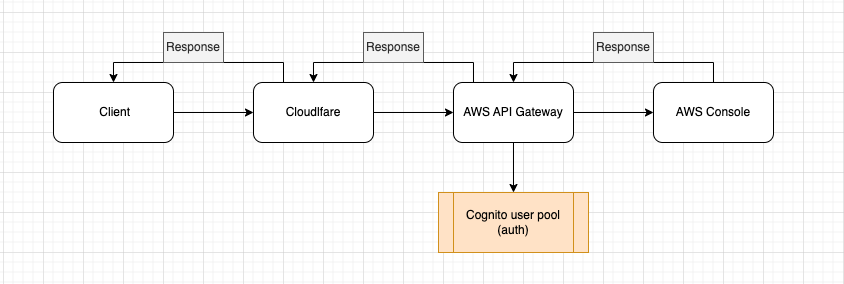
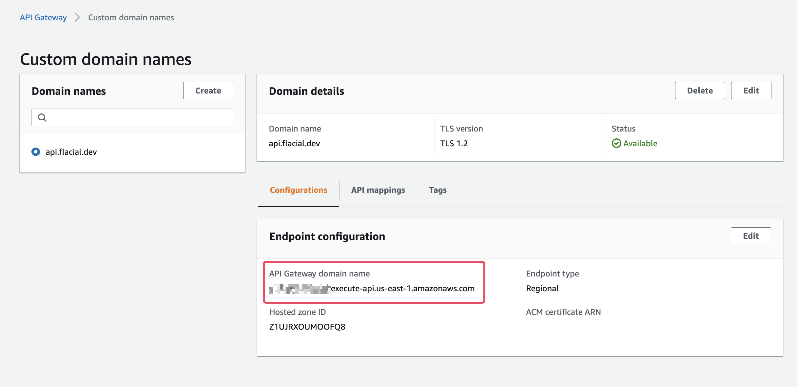

import MarkdownWrapper from '../../../../components/MarkdownWrapper'
import Layout from '../../../../components/Layout'
import Accordion from '../../../../components/Accordion'

<Layout title={props.pageContext.frontmatter.title} location={props.path}>
<MarkdownWrapper>

## Overview

This document provides a step-by-step guide to working with the provided API Gateway and authenticating the user with AWS Cognito, including how to integrate with Cloudflare. By following the instructions in this document, you will be able to create a fully working CDK stack that creates and connects AWS Cognito and AWS API Gateway

## Cloudflare Integration

Cloudflare Integration means that Cloudflare will act as the frontend for our AWS API Gateway. If a client want to send a request to API Gateway, the request will go through Cloudflare first and then AWS API Gateway, and if the request is authorized, it'll hit the AWS Console.

### Request from Client to AWS Console diagram



## Creating a fully working CDK stack

The follow CDK stack create and integrate AWS Cognito and AWS API Gateway. The steps are:

1. Create Cognito User Pool
   1. Create an app client
   2. Create a domain
2. Create a REST API Gateway
   1. Create a resource `/ditto`
   2. Create a `GET` HTTP Integration for the resource
   3. Create Cognito authorizer for the API Gateway
      - Uses the created Cognito User Pool instance to create the authorizer
   4. Set the authorization handler for the resource's `GET` method as the created Cognito's authorizer

### CDK Code

<Accordion summaryText="View code">

```ts
import * as cdk from 'aws-cdk-lib'
import * as apiGateway from 'aws-cdk-lib/aws-apigateway'
import * as cognito from 'aws-cdk-lib/aws-cognito'

export class CdkStack extends cdk.Stack {
  constructor(scope: cdk.App, id: string, props?: cdk.StackProps) {
    super(scope, id, props)

    // Create Cognito user pool
    const USER_POOL_ID = 'APIgatewayUserPool'
    const userPool = new cognito.UserPool(this, USER_POOL_ID, {
      // Allow users to sign-up
      selfSignUpEnabled: true,
      autoVerify: {
        email: true,
      },
      standardAttributes: {
        // By default, Cognito verify sign-ups. When the email isn't required-
        // Cognito hosted UI won't display it when singing up
        email: {
          required: true,
        },
      },
    })

    // Add an App Client. Necessary for the hosted API and-
    // for other apps to interact with Cognito API programmatically
    userPool.addClient('APIgatewayUserPoolClient')

    // Create a domain for the Hosted UI
    userPool.addDomain('Domain', {
      cognitoDomain: {
        // "onetwothree" are meant to make the prefix unique
        domainPrefix: 'apigatewayauthonetwothree',
      },
      // You could provide a custom domain instead
      // customDomain: 'myClient.website.com'
    })

    // Create REST API Gateway
    const api = new apiGateway.RestApi(this, 'ditto-api')

    // Declare HTTP Integration type with target as pokeAPI to be used later
    const httpIntegration = new apiGateway.HttpIntegration(
      'https://pokeapi.co/api/v2/pokemon/ditto'
    )

    // Add `/ditto` resource to the API Gateway
    const dittoResource = api.root.addResource('ditto')

    // Create Cognito authorizer for the API Gateway
    const cognitoAuth = new apiGateway.CognitoUserPoolsAuthorizer(
      this,
      'ApiGatewayAuth',
      {
        cognitoUserPools: [userPool],
      }
    )

    // Create a protected GET method with Cognito authorizer for `/ditto` resource
    dittoResource.addMethod('GET', httpIntegration, {
      authorizer: cognitoAuth,
      authorizationType: apiGateway.AuthorizationType.COGNITO,
    })
  }
}
```

</Accordion>

## Demo API Gateway with auth enabled

The following steps were performed to create the API Gateway with auth enabled:

1. Create a REST API
2. Create a resource and a method
3. Create a Congito user pool
4. Create Cognito authorizer from the Authorizers page
5. Set the Authorization option in the resource's Method Request to the created Cognito authorizer

### Working with the API Gateway

> The API Gateway has a custom URL because it'll later be integrated with Cloudflare; Explained in the next section.

**API Gateway URL:** https://api.flacial.dev

The API Gateway has auth enabled with AWS Cognito. It has one resource named `/ditto` that has a GET method with an HTTP integration that respond with a Pokemon from PokeAPI. The resource is protected and to access it, you'll have to provide a JWT token in the `Authorization` header.

You can get the JWT token by signing in to Congito's app client with the following credentials:

**Cognito app client URL:** https://apigatewayauthonetwo.auth.us-east-1.amazoncognito.com/login?client_id=24522a8kqqaq4ujnb29v48eptu&response_type=token&scope=aws.cognito.signin.user.admin+email+openid+phone+profile&redirect_uri=https%3A%2F%2Fexample.com

**username:** superdude
**password:** Superd3d$

Once you sign in, you'll be redirected to https://example.com, the URL has a query parameter with the name `id_token`, this is your JWT token. Save it somewhere.

> Usually, it doesn't contain the id_token, but if we set the response_type query parameter as "token" it'll include it

e.g, `https://example.com/#id_token=<JWT_TOKEN>...`

Using Postman or your favorite API testing tool, send a request to https://api.flacial.dev/ditto with/without the `Authorization` header wit the value of `id_token`:

With:

```sh
curl --location 'https://api.flacial.dev/ditto' \
--header 'Authorization: <YOUR_ID_TOKEN>'
```

Without:

```sh
curl --location 'https://api.flacial.dev/ditto'
```

#### Common errors

While creating/working with the API Gateway, you may encounter the following issues:

- If the JWT token is valid and you receive the response `message: "unauthorized"`, the JWT token has likely expired. Re-sign in and use the new JWT token.
- Make sure when creating the Cloudflare certificate, you set the Hostnames as `<subdomain>.<domain>` e.g, `api.flacial.dev` instead of `flacial.dev`, otherwise, API Gateway won't be able to intercept your requests from Cloudflare.

## Integrating Cloudflare with the API Gateawy

To do this, you'll have to follow the following steps:

1. [Generate a certificate in Cloudflare](https://developers.cloudflare.com/ssl/client-certificates/create-a-client-certificate/)
2. [Import the crertificate in AWS Certificate Manager (ACM)](https://docs.aws.amazon.com/acm/latest/userguide/import-certificate-api-cli.html)
3. Create a custom domain from API Gateway `Custom domain names` page
   - **(this is why our API Gateway domain is api.flacial.dev)**
   - https://docs.amazonaws.cn/en_us/apigateway/latest/developerguide/how-to-edge-optimized-custom-domain-name.html
4. Create an API mapping for your API Gateway and an optional path in your custom domain
   - It's basically saying, whenever a request is sent to this custom domain, forward it the selected API Gateway and its stage.
   - https://docs.aws.amazon.com/apigateway/latest/developerguide/http-api-mappings.html
5. Add a `CNAME` DNS record in your Cloudflare page that points a subdomain to the API Gateway domain name
   - You can find the API Gateway domain name by going to the created custom domain and Configuration
   - 
6. Set the encryption mode as Full
   - This is because AWS only supports an SSL certification, and not a valid, publicly trusted certificate. _This info require more research._
   - https://developers.cloudflare.com/ssl/origin-configuration/ssl-modes/

## Resources

- [(Exeternal) Integrating AWS API Gateway with Cloudflare](https://carocci-eugenio.medium.com/connect-cloudflare-to-aws-api-gateway-18e961a6e24f)
- [AWS CDK Cognito](https://docs.aws.amazon.com/cdk/api/v1/docs/aws-cognito-readme.html)
- [AWS CDK API Gateway](https://docs.aws.amazon.com/cdk/api/v1/docs/aws-apigateway-readme.html)
- [Cloudflare docs](https://developers.cloudflare.com/)
- [(External) Integrating AWS API Gateway with Cognito](https://www.youtube.com/watch?v=oFSU6rhFETk)
  - **Recommended YouTube channel**

</MarkdownWrapper>
</Layout>
