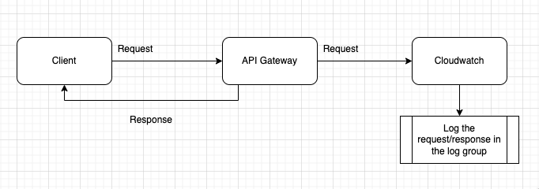

import MarkdownWrapper from '../../../../components/MarkdownWrapper'
import Layout from '../../../../components/Layout'
import AccordionComponent from '../../../../components/Accordion'

<Layout title={props.pageContext.frontmatter.title} location={props.path}>
<MarkdownWrapper>

# AWS API Gateway with Cloudwatch

## Overview

The following document is a step-by-step guide on integrating AWS API Gateway with Cloudwatch through the CDK

## Stack

The following stack creates AWS API Gateway with authentication provided by Cognito and logging provided by Cloudwatch.

### Steps

The following are the steps required to add Auth & Cloudwatch to the API Gateway. [This document](./api-gateway-with-auth#demo-api-gateway-with-auth-enabled) goes in more depth about adding Authentication

#### Request to log diagram



#### API Gateway + Auth

1. Create Cognito User Pool
   1. Create an app client
   2. Create a domain
2. Create a REST API Gateway
   1. Create a resource `/ditto`
   2. Create a `GET` HTTP Integration for the resource
   3. Create Cognito authorizer for the API Gateway
      - Uses the created Cognito User Pool instance to create the authorizer
   4. Set the authorization handler for the resource's `GET` method as the created Cognito's authorizer

#### API Gateway + Cloudwatch

1. Create a deployment instance of the REST API Gateway
2. Create a log group
3. Use the same Rest API Gateway from API Gateway + Auth
4. Create a dev stage with custom access logging & cloudwatch error/info logs enabled

### CDK Code

<AccordionComponent summaryText="View code">

```ts
import * as cdk from 'aws-cdk-lib'
import * as apiGateway from 'aws-cdk-lib/aws-apigateway'
import * as cognito from 'aws-cdk-lib/aws-cognito'
import * as logs from 'aws-cdk-lib/aws-logs'

export class CdkStack extends cdk.Stack {
  constructor(scope: cdk.App, id: string, props?: cdk.StackProps) {
    super(scope, id, props)

    // SECTION: API Gateway + Auth
    // Create Cognito user pool
    const USER_POOL_ID = 'APIgatewayUserPool'
    const userPool = new cognito.UserPool(this, USER_POOL_ID, {
      // Allow users to sign-up
      selfSignUpEnabled: true,
      autoVerify: {
        email: true,
      },
      standardAttributes: {
        // By default, Cognito verify sign-ups. When the email isn't required-
        // Cognito hosted UI won't display it when singing up
        email: {
          required: true,
        },
      },
    })

    // Add an App Client. Necessary for the hosted API and-
    // for other apps to interact with Cognito API programmatically
    userPool.addClient('APIgatewayUserPoolClient')

    // Create a domain for the Hosted UI
    userPool.addDomain('Domain', {
      cognitoDomain: {
        // "onetwo" are meant to make the prefix unique
        domainPrefix: 'apigatewayauthonetwo',
      },
      // You could provide a custom domain instead
      // customDomain: 'myClient.website.com'
    })

    // Create REST API Gateway
    const api = new apiGateway.RestApi(this, 'ditto-api', {
      // Automatically create a Cloudwatch role for this API
      cloudWatchRole: true,
    })

    // Declare HTTP Integration type with target as pokeAPI to be used later
    const httpIntegration = new apiGateway.HttpIntegration(
      'https://pokeapi.co/api/v2/pokemon/ditto'
    )

    // Add `/ditto` resource to the API Gateway
    const dittoResource = api.root.addResource('ditto')

    // Create Cognito authorizer for the API Gateway
    const cognitoAuth = new apiGateway.CognitoUserPoolsAuthorizer(
      this,
      'ApiGatewayAuth',
      {
        cognitoUserPools: [userPool],
      }
    )

    // Create a protected GET method with Cognito authorizer for `/ditto` resource
    dittoResource.addMethod('GET', httpIntegration, {
      authorizer: cognitoAuth,
      authorizationType: apiGateway.AuthorizationType.COGNITO,
    })
    // API Gateway + Auth end

    // SECTION: API Gateway + Cloudwatch start
    const deployment = new apiGateway.Deployment(this, 'Deployment', { api })

    // Create a log group for Cloudwatch
    const devLogGroup = new logs.LogGroup(this, 'DevLogs')

    // Create a dev stage for the API Gateway
    new apiGateway.Stage(this, 'dev', {
      stageName: 'dev',
      deployment,
      // Enables Custom Access Logging
      accessLogDestination: new apiGateway.LogGroupLogDestination(devLogGroup),
      accessLogFormat: apiGateway.AccessLogFormat.jsonWithStandardFields(),
      // Enabled Cloudwatch info & error loggings
      loggingLevel: apiGateway.MethodLoggingLevel.INFO,
    })
    // API Gateway + Cloudwatch end
  }
}
```

</AccordionComponent>

## Resources

- [Log groups](https://docs.aws.amazon.com/AmazonCloudWatch/latest/logs/Working-with-log-groups-and-streams.html)
- [REST API Deployment](https://docs.aws.amazon.com/cdk/api/v1/docs/@aws-cdk_aws-apigateway.Deployment.html)
- [AWS CDK Cognito](https://docs.aws.amazon.com/cdk/api/v1/docs/aws-cognito-readme.html)
- [AWS CDK API Gateway](https://docs.aws.amazon.com/cdk/api/v1/docs/aws-apigateway-readme.html)
- [(External) Integrating AWS API Gateway with Cognito](https://www.youtube.com/watch?v=oFSU6rhFETk)
  - **Recommended YouTube channel**
- [AWS CDK logs](https://docs.aws.amazon.com/cdk/api/v2/docs/aws-cdk-lib.aws_logs-readme.html)

</MarkdownWrapper>
</Layout>
```
