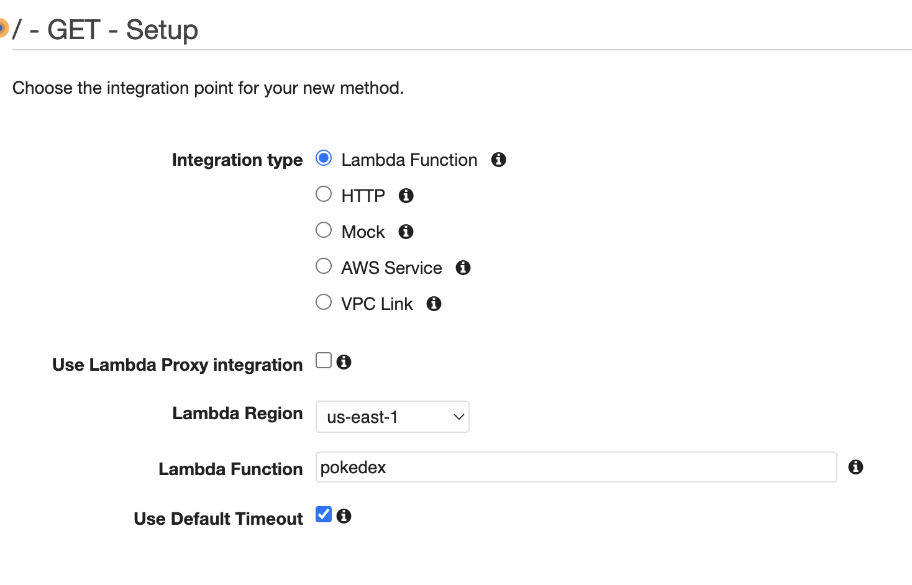

import MarkdownWrapper from '../../../../components/MarkdownWrapper'
import Layout from '../../../../components/Layout'

<Layout>
<MarkdownWrapper>

# AWS API Gateway

## What's AWS API Gateway?

Amazon Web Services (AWS) API Gateway is a fully managed service that makes it easy for developers to create, publish, maintain, monitor, and secure APIs at any scale. It acts as a "front door" for applications to access data, business logic, or functionality from your back-end services.

## AWS API Gateway vs Express.js API Gateway

### Express.js

An Express app could act as an API gateway, but it would require you to handle the management, scaling, and security of the API yourself, whereas with AWS API Gateway, it handles these things for you.

#### Logging

With an express.js app, you would have to manually set up logging for your API, whereas with AWS API Gateway, you can automatically log API requests and responses using Amazon CloudWatch.

```js
import winston from 'winston'
import expressWinston from 'express-winston'
import responseTime from 'response-time'

// middleware for logging requests and how fast they get responded to
app.use(
  expressWinston.logger({
    transports: [new winston.transports.Console()],
    format: winston.format.json(),
    statusLevels: true,
    meta: false,
    msg: 'HTTP {{req.method}} {{req.url}} {{res.statusCode}} {{res.responseTime}}ms',
    expressFormat: true,
    ignoreRoute() {
      return false
    },
  })
)

// to forward requests to other microservices (APIs)
const { createProxyMiddleware } = require('http-proxy-middleware')

app.use(
  '/search',
  createProxyMiddleware({
    target: 'http://api.duckduckgo.com/',
    changeOrigin: true,
    pathRewrite: {
      ['^/search']: '',
    },
  })
)

// ... some other proxy middlewares for other microservices
```

#### Authentication

With an express.js app, you would have to implement authentication and authorization mechanisms on your own, whereas with AWS API Gateway, you can easily integrate with AWS Identity and Access Management (IAM) for authentication and authorization.

```js
require('dotenv').config()

const session = require('express-session')

const secret = process.env.SESSION_SECRET
const store = new session.MemoryStore()
const protect = (req, res, next) => {
  const { authenticated } = req.session

  if (!authenticated) {
    res.sendStatus(401)
  } else {
    next()
  }
}

app.use(
  session({
    secret,
    resave: false,
    saveUninitialized: true,
    store,
  })
)

app.get('/login', (req, res) => {
  const { authenticated } = req.session

  if (!authenticated) {
    req.session.authenticated = true
    res.send('Successfully authenticated')
  } else {
    res.send('Already authenticated')
  }
})

app.get('/logout', protect, (req, res) => {
  req.session.destroy(() => {
    res.send('Successfully logged out')
  })
})

app.get('/protected', protect, (req, res) => {
  const { name = 'user' } = req.query
  res.send(`Hello ${name}!`)
})
```

#### Rate limiting

With an express.js app, you would have to implement rate limiting on your own, whereas with AWS API Gateway, you can easily configure rate limits on your API.

```js
import rateLimit from 'express-rate-limit'

// rate limiting
const limiter = rateLimit({
  windowMs: 15 * 60 * 1000, // 15 minutes
  max: 100, // Limit each IP to 100 requests per `window` (here, per 15 minutes)
})

// or app.use('/api', limiter)
app.use(limiter)

// ...
```

#### Scaling

With an express.js app, you would have to manually scale your API by spinning up additional servers and managing load balancers, whereas with AWS API Gateway, you can easily scale your API by adjusting the number of API Gateway instances.

In a traditional Express.js app, this is done with the `cluser` module.

```js
const express = require('express')
const cluster = require('cluster')
const os = require('os')

// checks if the cluster is the master one, if it's
// it starts all the workers
if (cluster.isMaster) {
  // get the number of CPU cores
  const numCores = os.cpus().length

  // start a worker for each core
  for (let i = 0; i < numCores; i++) {
    cluster.fork()
  }

  // listen for workers that exit and restart them
  cluster.on('exit', (worker) => {
    console.log(`worker ${worker.id} died. restarting...`)
    cluster.fork()
  })
} else {
  // every time a worker is created, it'll execute this exact file
  // with (cluster.fork)
  // and since it's not the master cluster, it'll run this `else` block

  // create the Express app
  const app = express()

  // add routes
  app.get('/', (req, res) => {
    res.send('Hello, World!')
  })

  // start the server
  const port = 3000
  app.listen(port, () => {
    console.log(`Worker ${cluster.worker.id} listening on port ${port}`)
  })
}
```

### AWS API Gateway

##### Other features

- Integration with [AWS WAF](https://docs.aws.amazon.com/apigateway/latest/developerguide/apigateway-control-access-aws-waf.html) for protecting your APIs against common web exploits.
- Integration with [AWS X-Ray](https://docs.aws.amazon.com/apigateway/latest/developerguide/apigateway-xray.html) for understanding and triaging performance latencies.

##### Some important concepts

- API key: An alphanumeric string that API Gateway uses to identify an app developer who uses your REST or WebSocket API.

#### REST APIs vs HTTP APIs

Below you'll find the exclusive features for each API type.

- REST API
  - API keys
  - Per-client rate-limiting
  - Per-client usage throttling
  - Resource policies (who can invoke the API)
  - Certificates for backend auth
    - You can use this certificate to verify that incoming requests to your backend are from API Gateway, ensuring that only authorized requests are accepted. This improves the security of your backend system, even if it is publicly accessible.
  - AWS WAF(web exploits protection)
  - Edge-optimized
    - Means that an API that is designed to have low latency and high availability. This is achieved by having the API endpoint located at the edge of the network, closer to the users that are accessing it.
  - Private (second type of REST API)
    - A private endpoint in AWS refers to an endpoint that is only accessible within a virtual private cloud (VPC) or over an AWS Direct Connect link and not over the Internet. This means that the endpoint can only be accessed by resources within the same VPC or via a dedicated network connection, rather than over the public internet. This can be useful for situations where you want to keep certain resources or data private and only accessible by authorized users or systems.
    - E.g, school campus or a bank
  - Request caching
  - [AWS X-Ray tracing](https://docs.aws.amazon.com/apigateway/latest/developerguide/apigateway-xray.html)
  - [Execution logs](https://docs.aws.amazon.com/apigateway/latest/developerguide/set-up-logging.html)
  - [Access logs to Amazon Kinesis Data Firehose](https://docs.aws.amazon.com/apigateway/latest/developerguide/apigateway-logging-to-kinesis.html)
  - [Private integrations with Application Load Balancers](https://docs.aws.amazon.com/apigateway/latest/developerguide/http-api-develop-integrations-private.html)
  - [Private integrations with AWS Cloud Map](https://docs.aws.amazon.com/apigateway/latest/developerguide/http-api-develop-integrations-private.html)
- HTTP API
  - Automatic deployments
  - JWT
- WebSocket API

Major difference, an HTTP API only works with Lambda and HTTP backends (some Express.js API), while a REST API works with these too and other AWS services.

Usually, an HTTP API is sufficient for Lambda function or HTTP backends as it costs less and provides lower latency.

#### Creating an HTTP API for Pokedex with HTTP backend

First we go to the AWS API Gateway panel, and select an HTTP API. The page `Create and configure integrations` will show up:

**Integrations**: Type of the integration whether it's a Lambda function or HTTP endpoint

**Method**: Request method `GET`, `POST`, ...etc

**URL Endpoint**: In our case, it's https://pokeapi.co/api/v2/pokemon-form/pikachu


Next, Configure routes page. We choose what resource path and method that when are requests, will target https://pokeapi.co/api/v2/pokemon-form/pikachu

We can set the resource path to anything, so I set it to `/pokedex` and the method is `GET` instead of `ANY` even though `ANY` would've worked.


Next, Configure stages. We can use the default stage name here, and with auto-deploy on.

> Stages are associated with a specific deployment of an API. A deployment is a snapshot of an API's configuration and resources at a given point in time. You can create multiple deployment stages, each with its own settings, and then use them to test different versions of your API before promoting them to production. They're like GitHub branches.


Once this step is done, we create the API Gateway and we get this link https://7m3eb19o5m.execute-api.us-east-1.amazonaws.com/pokedex that once accessed, redirect our request to pokeAPI and returns the response from it.

#### Creating a REST API for Pokedex with a Lambda function

For this project, we'll create a Lambda function written in JavaScript that sends a request to [PokeAPI](https://pokeapi.co/api/v2/pokemon-form/pikachu) and return the response.

Our Lambda function will have the following code:

```js
export const handler = async (event) => {
  const res = await global.fetch(
    'https://pokeapi.co/api/v2/pokemon-form/pikachu'
  )
  return {
    statusCode: 200, // essential
    body: await res.json(),
  }
}
```

**Info**: It's essential to return at least a `statusCode` when Integrating a Lambda Function with AWS API Gateway

To be able to call the lambda function from an endpoint, we'll create a new REST API gateway for it.

##### Choosing an API type

As we discussed in the REST APIs vs HTTP APIs section, there are 4 types of APIs that we can choose from. We'll pick a public REST API.

In Amazon API Gateway after hitting `Create an API`, we'll find this page:


We chose our API to be REST instead of Websocket, and create it from scratch. After creating the API, we'll land on this page for configuring the API methods, resources, authorizers, ...etc:


##### Creating a Resource

Before Integrating the Lambda Function with the API Gateway, we'll create a resource that we can Invoke the Lambda function from instead of the root resource `/`


Set the resource name and path as `pokedex`


After we create it, the resources will look like this:


##### Creating a method for /pokedex resource

We'll create a new `GET` method for the `pokedex` resource that Integrates with our Lambda function


Select the Integration type as Lambda Function and `pokedex` as the Lambda function:



##### Testing the resource endpoint

Once the method is created, the following page will show and we can adjust our configurations from it or test the API. It's really handy when we want to quickly debug an API that responds with an error:


If we tried to test the API by clicking TEST button and hit Test again in the next page, we'll notice that it throws the error: `Execution failed due to configuration error: No match for output mapping and no default output mapping configured`

This is because we didn't specify what kind of response the method should respond with. Even though it shows `HTTP Status: 200` under `Method Response`, we still need to specify that.

A quick click to `Method Response` will open the following view where we can select the response type it should expect from the Integration response:


If we tried to test the API again, it'll work as expected:


##### Deploying the API

After creating a new API or applying changes to an exisitng one, we always have to deploy it.

We deploy the API from the `Actions`:


##### Stages

Stages refer to different versions of an API that can be created, managed, and deployed separately within the API Gateway service. Whenever we deploy an API, we can choose whether we want to overwrite an existing stage or creata a new one.

It's helpful if we want to:

1. Test out a version of an API without affecting the production one
2. Deploy the API to different regions
3. Apply different security settings to different APIs

##### Invoking the API from a public URL

After we deploy it, we can now invoke the API from the provided Invoke URL that we can find by going to Stages -> prod -> `/` -> GET:


For our example, it's https://mn9hd5qc51.execute-api.us-east-1.amazonaws.com/Prod/pokedex try to open this URL!

### Advanced usage for AWS API Gateway

_WIP..._

## Resources

- AWS API Gateway
  - [Main docs](https://docs.aws.amazon.com/apigateway/latest/developerguide/welcome.html)
  - [REST API VS HTTP API](https://docs.aws.amazon.com/apigateway/latest/developerguide/http-api-vs-rest.html)
- [Express.js API Gateway](https://snyk.io/blog/how-to-build-secure-api-gateway-node-js/)
- [Method response type](https://www.any-api.com/amazonaws_com/apigateway/docs/Definitions/MethodResponse)

</MarkdownWrapper>
</Layout>
