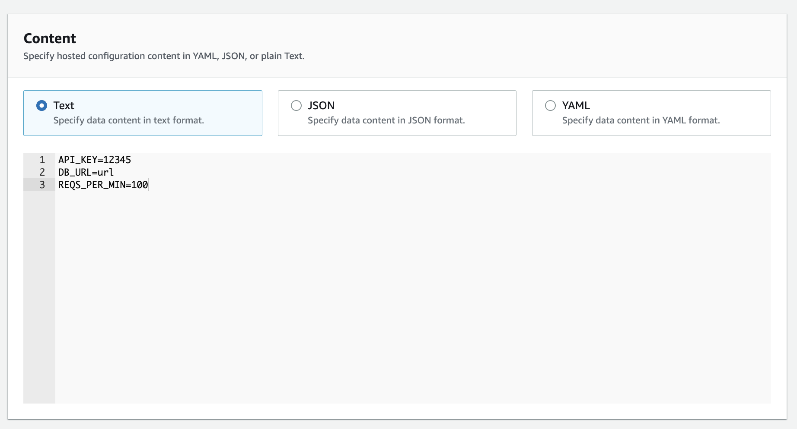

import MarkdownWrapper from '../../../../components/MarkdownWrapper'
import Layout from '../../../../components/Layout'
import Accordion from '../../../../components/Accordion'

<Layout title={props.pageContext.frontmatter.title}>
<MarkdownWrapper>

# AWS — AppConfig


## Creating and using a flag in a web app

We have a web app that displays cat photos. We want to also show dog photos, but we want to do it by enabling the feature linearly for 10 users, 20, 30.... etc in a gradual way.

### Creating and deploying a configuration

Here we'll create the feature flag with the name `dogs_view` that's off by default.

#### Create the app

<Accordion summaryText="Steps to create the app and configs">

In this step, we created an app named Cute pets site


#### Create the configuration profile

In this step, we created a configuration profile named AllowedPanels for Cute pets site


#### Create the feature flag


#### Create the environment

In this step, we created a Production environment that'll be deploy the configuration profile to.


#### Deploy

Select the Quick deployment strategy and proceed to deploy.


</Accordion>

### Getting the configurations in the client

[Link for the client or web app](), **Let me know when you open it, so I can switch the feature on.**

We'll use [`@aws-sdk/client-appconfigdata`](https://docs.aws.amazon.com/AWSJavaScriptSDK/v3/latest/clients/client-appconfigdata/index.html#description) to retrieve the configurations. Here's an example with Next.js.

#### Steps

1. Initiate the AppConfig client with each layer ID
2. Send a [StartConfigurationSession command](https://docs.aws.amazon.com/appconfig/2019-10-09/APIReference/API_appconfigdata_StartConfigurationSession.html) to get the initial configuration token
3. Send a [GetLatestConfiguration command](https://docs.aws.amazon.com/appconfig/2019-10-09/APIReference/API_appconfigdata_GetLatestConfiguration.html) to get the latest configurations
4. Convert the `Configuration` from Uint8Array to JSON
5. Respond to the client

`api/config.ts`

<Accordion summaryText="View API code">

```ts
import type { NextApiRequest, NextApiResponse } from 'next'
import {
  AppConfigDataClient,
  GetLatestConfigurationCommand,
  StartConfigurationSessionCommand,
} from '@aws-sdk/client-appconfigdata'

type Data = {
  config: {
    string: string
  }
}

let token = null

export default async function handler(
  req: NextApiRequest,
  res: NextApiResponse<Data>
) {
  // Initiate AppConfig Client
  const client = new AppConfigDataClient({ region: 'us-east-1' })

  // Find these by going to each layer's details
  const params = {
    ApplicationIdentifier: process.env.APPLICATION_IDENTIFIER,
    ConfigurationProfileIdentifier:
      process.env.CONFIGURATION_PROFILE_IDENTIFIER,
    EnvironmentIdentifier: process.env.ENVIRONMENT_IDENTIFIER,
  }

  // Command used to get the initial configuration token
  const command = new StartConfigurationSessionCommand(params)

  // Store the token
  token = (await client.send(command)).InitialConfigurationToken

  // Command to get the latest configuration. It takes the initial token
  // and responds with a new token
  const getConfigsCommand = new GetLatestConfigurationCommand({
    ConfigurationToken: token,
  })

  const configsRes = await client.send(getConfigsCommand)

  // Convert Uint8Array to JSON
  const configs = JSON.parse(
    Buffer.from(configsRes.Configuration || []).toString('utf-8')
  )

  res.status(200).json({ config: configs })
}
```

</Accordion>

`pages/home.ts`

<Accordion summaryText="View Frontend code">

```tsx
import Image from 'next/image'
import { Inter } from '@next/font/google'
import useSWR from 'swr'

const inter = Inter({ subsets: ['latin'] })

// @ts-ignore
const fetcher = (...args) => fetch(...args).then((res) => res.json())

type Config = {
  config: {
    dogs_view: {
      enabled: boolean
    }
  }
}

export default function Home() {
  const { data, error, isLoading } = useSWR<Config>('/api/config', fetcher)

  if (isLoading) return <h1>Loading...</h1>
  if (error) {
    console.log(error)
    return <h1>Something went wrong, check the console</h1>
  }

  const canViewDogs = data?.config?.dogs_view?.enabled

  let view = (
    <div>
      <Image
        src={'http://placekitten.com/400/400'}
        alt={'Cute cat'}
        height={400}
        width={400}
      ></Image>
    </div>
  )

  if (canViewDogs) {
    view = (
      <div>
        <Image
          src={'https://placedog.net/500'}
          alt={'Cute dog'}
          width={500}
          height={500}
        ></Image>
      </div>
    )
  }

  return (
    <div className={inter.className}>
      <h1>{canViewDogs ? 'You may only see DOGS' : 'You may only see CATS'}</h1>
      <small>
        If you see dogs, it means the flag is on, if you see cats it's off
      </small>
      {view}
    </div>
  )
}
```

</Accordion>

## Freeform

Freeform option allows you to specify your key-value pairs for configuration data instead of using a pre-defined schema.

You can create a configuration file to store your application's API keys, server URLs, or text.



### Validator

Allows you to validate the Freeform configuration data before it's deployed to your applications. It allows you to define a schema for your Freeform configuration data, and then use that schema to validate the configuration data before it's deployed.

Validator example:

```json
{
  "$schema": "http://json-schema.org/draft-07/schema#",
  "type": "object",
  "properties": {
    "pikachuName": {
      "type": "string"
    },
    "age": {
      "type": "number"
    }
  },
  "required": ["pikachuName", "age"]
}
```

## Deployment strategy

It defines the growth type of how a configuration update is rolled out.

### Linear

For this type, AWS AppConfig processes the deployment by increments of the growth factor evenly distributed over the deployment. For example, a linear deployment that uses a step percentage of 20 initially makes the configuration available to 20 percent of the targets. After 1/5th of the deployment time has passed, the system updates the percentage to 40 percent. This continues until 100% of the targets are set to receive the deployed configuration.

### Exponential

For this type, AWS AppConfig processes the deployment exponentially using the following formula: `G*(2^N)`. In this formula, `G` is the step percentage specified by the user and `N` is the number of steps until the configuration is deployed to all targets.

Example if the growth factor is 4:

```
2*(2^0)
2*(2^1)
2*(2^2)
```

### Bake time

As mentioned before, the amount of time AWS AppConfig monitors CloudWatch for alerts and rollback if there are any. It could be 10 minutes, 3 hours, or completely skipped.

### Resource

- https://docs.aws.amazon.com/appconfig/latest/userguide/appconfig-creating-deployment-strategy.html
- https://docs.aws.amazon.com/appconfig/2019-10-09/APIReference/API_DeploymentStrategy.html

## Theory

AWS AppConfig is a service that makes it easy for engineers to safely push out new features in a measured and gradual way. With AppConfig, you can easily manage and update your configurations without having to push code to production. This is especially helpful when you want to test different configurations like in A/B testing scenarios. It's a great way to roll out new features and test them out before making them live for everyone.

The following paragraphs from this [blog post](https://aws.amazon.com/blogs/mt/using-aws-appconfig-feature-flags/) explain it perfectly:

> The “earlier” way to release a feature is to first build the code, then test it in QA, and get ready to deploy to Production. Engineers need to align the code merge and deployment with the date and time when marketing wants it released. Once that is all ready to go, on release day, you push out your new code to Production, and hope everything goes smoothly. As long as timing goes well, your customers can access the feature all at once. Engineers feverishly monitor performance metrics to make sure that the new feature did not introduce instability. This is sometimes known as “a push-and-pray deployment” since you don’t know how your code will behave on Production until everybody already has it.

> Modern software practices use feature flags when releasing new functionality. Using this technique, engineers separate code from configuration data. One can hide their feature behind a configuration toggle (a feature flag) and deploy the code to Production. However, since the code is hidden behind their flag, customers cannot access the feature. The engineer can flip the flag for a very limited group of users (for example, just themselves, or just internal users) and test out the feature on Production. The engineer can then gradually open access to more and more users. Assuming no alarms are going off during the gradual release of the feature, and other metrics are where you expect them, the deployment continues safely until 100% of users have the new feature.

### Similar service

[Vercel Edge Config](https://vercel.com/blog/edge-config-ultra-low-latency-data-at-the-edge) is very similar to it and if we wanted to store our app configurations somewhere, Vercel would be the best choice because it works perfectly with Next.js.

## Resources

- https://docs.aws.amazon.com/appconfig/latest/userguide/what-is-appconfig.html
- [Lambda Function Feature Flags](https://www.youtube.com/watch?v=sq2HcRMLaLU)
- https://aws.amazon.com/blogs/aws/safe-deployment-of-application-configuration-settings-with-aws-appconfig/

</MarkdownWrapper>
</Layout>
