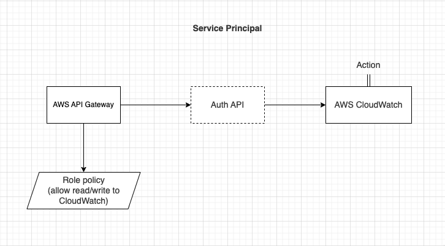
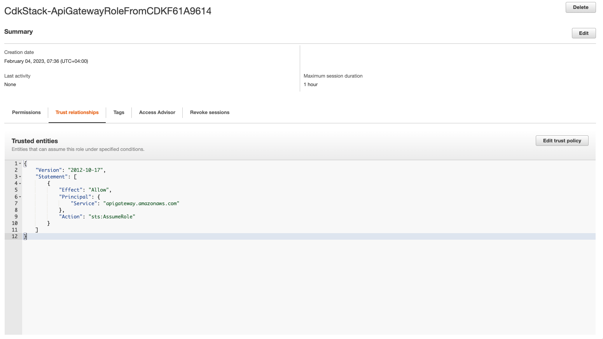

import MarkdownWrapper from '../../../../components/MarkdownWrapper'
import Layout from '../../../../components/Layout'

<Layout title={props.pageContext.frontmatter.title} location={props.path}>
<MarkdownWrapper>

## Principals

A principal is an AWS entity that can assume a role and take its permissions to perform some actions in AWS.

It could be:

- AWS account
- IAM role
- IAM user
- Federated SAML users

### Service Principal

The method [`ServicePrincipal`](https://docs.aws.amazon.com/cdk/api/v2/docs/aws-cdk-lib.aws_iam.ServicePrincipal.html) from the CDK is used to represent the service that can assume the role.

[Remember when we wanted to log the requests made by API Gateway to CloudWatch?](./api-gateway#logging-1) We had to first create a service role that has the permissions to log to CloudWatch and this role can ONLY be assumed by API Gateway service.



The service principal for allowing API Gateway to create log events in CloudWatch has the following policy:

```json
{
  "Version": "2012-10-17",
  "Statement": [
    {
      "Effect": "Allow",
      "Action": [
        "logs:CreateLogGroup",
        "logs:CreateLogStream",
        "logs:DescribeLogGroups",
        "logs:DescribeLogStreams",
        "logs:PutLogEvents",
        "logs:GetLogEvents",
        "logs:FilterLogEvents"
      ],
      "Resource": "*"
    }
  ]
}
```

To do the same thing using CDK:

```ts
import * as iam from 'aws-cdk-lib/aws-iam'
import * as cdk from 'aws-cdk-lib'

export class CdkStack extends cdk.Stack {
  constructor(scope: cdk.App, id: string, props?: cdk.StackProps) {
    super(scope, id, props)

    // Create the role for API Gateway
    const role = new iam.Role(this, 'ApiGatewayRoleFromCDK', {
      // Which entity can use its permissions
      assumedBy: new iam.ServicePrincipal('apigateway.amazonaws.com'),
    })

    // Create the policy for logging in CloudWatch
    const policy = new iam.Policy(
      this,
      'ApiGatewayCloudWatchLogPolicyFromCDK',
      {
        policyName: 'ApiGatewayCloudWatchLogPolicyFromCDK',
        statements: [
          new iam.PolicyStatement({
            actions: [
              'logs:CreateLogGroup',
              'logs:CreateLogStream',
              'logs:DescribeLogGroups',
              'logs:DescribeLogStreams',
              'logs:PutLogEvents',
              'logs:GetLogEvents',
              'logs:FilterLogEvents',
            ],
            resources: ['*'],
          }),
        ],
      }
    )

    // Attach the policy to the role
    role.attachInlinePolicy(policy)
  }
}
```

To confirm the role has the correct principal and policy, we can go to IAM -> Roles -> The new role -> Trust relationships:



As we can see, it has API Gateway as the service principal.

### More info

When manually creating a role from IAM console, this is how each entity is technically named:


### Resources

- [IAM Principal Examples in CDK](https://bobbyhadz.com/blog/aws-cdk-iam-principal#service-principal-example-in-aws-cdk)
- [Understanding IAM](https://docs.aws.amazon.com/IAM/latest/UserGuide/intro-structure.html)
- [service-linked role vs service role](https://docs.amazonaws.cn/en_us/IAM/latest/UserGuide/using-service-linked-roles.html)

</MarkdownWrapper>
</Layout>
